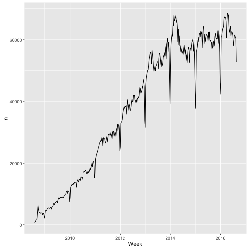
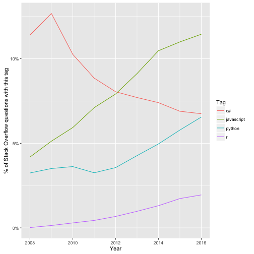

## StackLite: A simple dataset of Stack Overflow questions and tags

This repository shares a dataset about Stack Overflow questions. For each question, it includes:

* Question ID
* Creation date
* Closed date, if applicable
* Deletion date, if applicable
* Score
* Owner user ID
* Number of answers
* Tags

This dataset is ideal for answering questions such as:

* The increase or decrease in questions in each tag over time
* Correlations among tags on questions
* Which tags tend to get higher or lower scores
* Which tags tend to be asked on weekends vs weekdays
* Rates of question closure or deletion over time
* The speed at which questions are closed or deleted

This is all public data within the [Stack Exchange Data Dump](https://archive.org/details/stackexchange), which is much more comprehensive (including question and answer text), but also requires much more computational overhead to download and process. This dataset is designed to be easy to read in and start analyzing. Similarly, this data can be examined within the [Stack Exchange Data Explorer](https://data.stackexchange.com/), but this offers analysts the chance to work with it locally using their tool of choice.

### Status


This dataset was extracted from the Stack Overflow database at 2017-04-06 16:39:26 UTC and contains questions up to **2017-04-05**. This includes 13629741 non-deleted questions, and  4133745 deleted ones. (The script for downloading the data can be found in [setup-data.R](setup-data.R), though it can be run only by Stack Overflow employees with database access).

### Examples in R

The dataset is provided as csv.gz files, which means you can use almost any language or statistical tool to process it. But here I'll share some examples of an analysis in R.

The question data and the question-tag pairings are stored separately. You can read in the dataset with:


```r
library(readr)
library(dplyr)

questions <- read_csv("questions.csv.gz")
question_tags <- read_csv("question_tags.csv.gz")
```


```r
questions
```

```
## # A tibble: 17,763,486 × 7
##       Id        CreationDate          ClosedDate        DeletionDate Score
##    <int>              <dttm>              <dttm>              <dttm> <int>
## 1      1 2008-07-31 21:26:37                <NA> 2011-03-28 00:53:47     1
## 2      4 2008-07-31 21:42:52                <NA>                <NA>   472
## 3      6 2008-07-31 22:08:08                <NA>                <NA>   210
## 4      8 2008-07-31 23:33:19 2013-06-03 04:00:25 2015-02-11 08:26:40    42
## 5      9 2008-07-31 23:40:59                <NA>                <NA>  1452
## 6     11 2008-07-31 23:55:37                <NA>                <NA>  1154
## 7     13 2008-08-01 00:42:38                <NA>                <NA>   464
## 8     14 2008-08-01 00:59:11                <NA>                <NA>   296
## 9     16 2008-08-01 04:59:33                <NA>                <NA>    84
## 10    17 2008-08-01 05:09:55                <NA>                <NA>   119
## # ... with 17,763,476 more rows, and 2 more variables: OwnerUserId <int>,
## #   AnswerCount <int>
```

```r
question_tags
```

```
## # A tibble: 52,224,835 × 2
##       Id                 Tag
##    <int>               <chr>
## 1      1                data
## 2      4                  c#
## 3      4            winforms
## 4      4     type-conversion
## 5      4             decimal
## 6      4             opacity
## 7      6                html
## 8      6                 css
## 9      6                css3
## 10     6 internet-explorer-7
## # ... with 52,224,825 more rows
```

As one example, you could find the most popular tags:


```r
question_tags %>%
  count(Tag, sort = TRUE)
```

```
## # A tibble: 59,140 × 2
##           Tag       n
##         <chr>   <int>
## 1  javascript 1712324
## 2        java 1614786
## 3         php 1406127
## 4          c# 1356681
## 5     android 1327680
## 6      jquery 1035978
## 7      python  898647
## 8        html  804340
## 9         ios  652484
## 10        c++  645197
## # ... with 59,130 more rows
```

Or plot the number of questions asked per week:


```r
library(ggplot2)
library(lubridate)

questions %>%
  count(Week = round_date(CreationDate, "week")) %>%
  ggplot(aes(Week, n)) +
  geom_line()
```



Or you could compare the growth of particular tags over time:


```r
library(lubridate)

tags <- c("c#", "javascript", "python", "r")

q_per_year <- questions %>%
  count(Year = year(CreationDate)) %>%
  rename(YearTotal = n)

tags_per_year <- question_tags %>%
  filter(Tag %in% tags) %>%
  inner_join(questions) %>%
  count(Year = year(CreationDate), Tag) %>%
  inner_join(q_per_year)

ggplot(tags_per_year, aes(Year, n / YearTotal, color = Tag)) +
  geom_line() +
  scale_y_continuous(labels = scales::percent_format()) +
  ylab("% of Stack Overflow questions with this tag")
```


